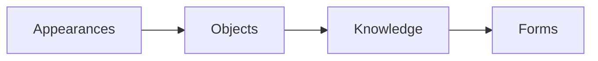
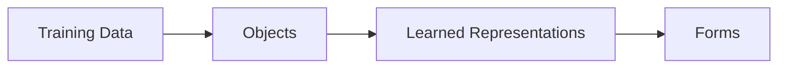
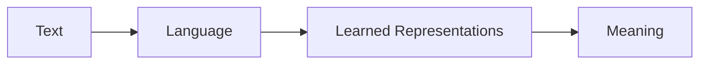

In the [last post](so_what_if_plato_was_right_1) I wrote about Plato, the Theory of Forms, and the allegories of the Sun, the Divided Line, and the Cave (all from Plato's *Republic*).

What I wanted to write up next was a deeper dive on the arguments around LLM's, embeddings, the "Platonic Representation Hyopthesis" (PRH) [paper](https://arxiv.org/abs/2405.07987), as well as the "Harnessing the Universal Geometry of Embeddings" (HUGE) [paper](https://arxiv.org/abs/2505.12540), since they have been at the center of a lot of recent riffing on my socials, e.g.:

![[mollick_plato_tweet.png]]
([source](https://bsky.app/profile/emollick.bsky.social/post/3lpsmendhsk2y))

I was struggling to tie this all together, but fortunately for me, just this morning, @segyges.bsky.social published an [overview](https://www.verysane.ai/p/some-thoughts-on-the-platonic-representation) of the discourse.  In particular, they coin the term "empirical Platonism" to describe how, in the process of machine learning, a neural network can learn a model of the world from chaotic training data.  

I really like this terminology, because it highlights both the similarity, as well as the difference, between the way an LLM learns representations, and eventually gains the capability to generalize, vs. the way humans acquire knowledge, according to Plato.

As always, Plato's work is incredibly rich on questions of knowledge, text, representation, and communication, and serves as a very useful lens for thinking hard about LLM's - so what I'll do in the rest of this post is pull in some other references from Plato's Republic, and try to unpack the PRH and other research in those terms, and see if it produces any insights.  

If you haven't read it yet, definitely go read the post above, and both the PRH and HUGE papers are quite readable as well.

## The Divided Line

The Allegory of the Cave is one of the most renowned metaphors in all of philosophy, for good reason, and it is a useful way to think about a wide variety of situations.  But, as I noted last time, Plato accompanies it with *two other* metaphorical accounts of the structure of knowledge and reality - the Allegory of the Sun and the Allegory of the Divided Line - and the latter of those is especially pertinent here.

In the Allegory of the Divide Line, we experience and come to know reality via a series of representations or derivations, all of which point back up toward an ultimate source, the Forms.  You could diagram it something like this (in the Republic, Socrates also make a nuanced argument about the relative size of the segments that I am ignoring for brevity):

And I think if we were to try to diagram the metaphysics of the PRH paper, as we described them above, we could represent it like so:

and although there are other ways to think about this, I think this makes sense, and it is actually very much aligned with how Plato describes that third level of Knowledge, which is primarily made up of scientific and mathematical theories that are learned from observation.

This also vibes with @segyges' illustration of the Allegory of the Cave:

![[plato_cave.png]]

Which is a great translation of the allegory of the cave to a modern perspective, and also highlights one of the big open questions: if the text a model is trained on is produced by humans with keyboards and smartphones,  to what extent is that training data aligned with reality at all?  Or conversely, can we think of text as being representative of reality in the same way as an illuminated object casts a shadow?

## Language, Lies, and Hallucination

In this framing, I think it is intuitively pretty clear that *not all language represents reality*.  A human who produces text can be misinformed, or lie intentionally, or be writing a work of fiction that has no connection to reality - and an LLM being trained on vast amounts of data doesn't get labels like "this reddit post is fanfiction | this one is exhaustively researched and accurate | this one is just wrong" - pre-training gets the whole firehose of text in its raw form, and LLM's notoriously continue to suffer from hallucinations as a result.

Plato also gives us good insight on the relationship between text, image, and reality - even though he didn't have access to a smart phone, or even a camera.  The *Republic* gets especially deep into questions of true and false representations, or imitations, and spends a good chunk of books II, III, and X on this topic in particular.  There is a good summary on the [Stanford Encyclopedia of Philosophy](https://iep.utm.edu/republic/#SH1j), and the original is also [online on Perseus](https://www.perseus.tufts.edu/hopper/text?doc=Perseus%3Atext%3A1999.01.0168%3Abook%3D10%3Asection%3D597a), but I'll try to summarize.  

Plato (via Socrates) characterizes a painting or a poem that attempts to represent reality as "an imitation of a phantasm", and says that the "mimetic art" is very far removed from the truth, and that even the greatest poets lack any knowledge of the Forms, or virtue, or reality.  And that 
> "if [the poet] had genuine knowledge of the things he imitates he would far rather devote himself to real things than to the imitation of them, and would endeavor to leave after him many noble deeds." - Plato Rep. 10.599b

This whole section is a hoot to read, and it hits kind of close to home for me, and I think for a lot of people who consume and produce a lot of media - Plato is pretty strongly against representation and most of what we'd recognize as art, and in his utopian city-state advocates for censorship to an extent that comes off as totalitarian.  FWIW, Plato was a failed poet prior to his philosophy career.

Plato's political ideology is worth a post of its own, but for now, I think this also gives us another way to look at the relation of language and embeddings to reality.

## Language Models vs. World Models

If we accept that language is not directly or inherently connected to reality or the Forms at all, we can instead consider language itself as a thing, and as an object of study, and we can diagram this in the same way as we did before with the divided line:

And I feel pretty comfortable with this diagram.  It explicitly distingusihes text from language, and at the top, we have the abstract "meaning" or semantics of language, which an LLM or embedding model is approximating statistically.

This is a much less sweeping metaphysical claim than we were making before, and it seems consistent with common sense - that there has to be some shared sense of meaning for language to work, and for communication to be possible, and that to the extent that modern LLM's are more compelling than a Markov chain from the 90's, it is precisely because they are "understanding" language in a substantive way.

This approach also provides a better account for lies, fiction, and hallucinations.  I can tell you a false or made-up story, but it is still possible for you to misunderstand it, or to understand it accurately.  A false statement can still bear meaning and have legible semantics.

@theophite stated a position that I think is pretty close to this one: 

> i think that people are confusing "the LLM contains ground truths about the world" with "the LLM contains contingent truths about language which are a low-dimensional map of certain known ground truths about the world. [source](https://bsky.app/profile/theophite.bsky.social/post/3lpum5qtkys2j)

Which I think is a reasonable and conservative metaphysical position.

## Language, Vision Models, and Convergence

That said, the best argument I see in favor of a stronger epistemological or metaphysical claim is the PRH paper's observation that not only are language models and vision models each converging, they are growing more similar to one another, as this diagram from the paper illustrates:

![[prh_diagram.png]]

This took me quite a few readings of the paper to grok, because on initial reading, I assumed the claim of convergence to mean that the embeddings produced by models were becoming more and more geometrically alike, but the paper's claim is a bit more nuanced: 
> "as vision models and language models get larger, they measure distance between datapoints in a more and more alike way."

The methodological heart of the paper is the "Mutual K-nearest neighbor alignment metric" - where they take a large dataset of captioned images, and for each image, take its 10 nearest neighbors in the embedding's vector space.  They can then measure the similarity between two embeddings of the same image/text by the degree to which the neighbors overlap - not via any mathematical transformation of the embeddings themselves - and comparing a text embedding of a captioned picture of a potato with an image embedding of a captioned picture of a turnip starts to make sense.

The HUGE paper does go a bit further, and uses a neural net to learn a universal translation layer, but they do that for text embeddings only, and I'm likewise skeptical that it'll be easy to translate between text and image embeddings.  Which makes the PRH finding all the more surprising, and maybe stronger: if vision and language models represent objects in ways that are fundamentally alike, that does seem to represent some kind of knowledge, at least with respect to objects and their categories, that is more universal.  It might still be pretty closely aligned with @theophite's observation above, but I think it's nonetheless a remarkable thing to have empirical evidence of.

## What does it mean/what's next?

I think this is most of what I wanted to convey in this post, after struggling to write a few very different drafts of it.  But what I think is so exciting about LLM research right now is that it is moving fast, and a paper could come out next week that has consequences in some of these deeply metaphysical questions, as well as real-world applications and impacts.  

I'll be really interested to see where research on translating embeddings goes.  Getting locked in to a proprietary embedding model is a real problem with commercial consequences, so I expect there to be funding and resources, and I would be especially fascinated to see whether a universal translation layer, of the sort HUGE demonstrates, is useful as an embedding model on its own; or conversely, if a technique is demonstrated for translating embeddings without an intermediate layer, and I think either would inflect parts of the arguments I made above.

This points to even more fundamental questions about what embeddings do, and why they are used at so many points in LLM architecture, but I'd want to get more feedback from ML researchers before I get out over my skis on this one.  

On that note - I'd welcome feedback on any of this, and huge thanks to the Bluesky ML folks for all the discussions over the last few months.

Next time, I'll pick up the other side of the Platonic question, around the emergent values, behaviors, and other alignment characteristics of LLM's, and hopefully that post will be easier to write.